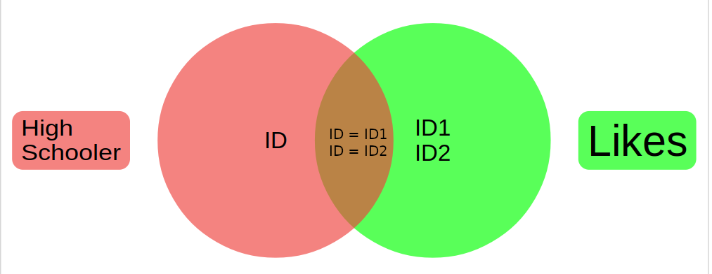
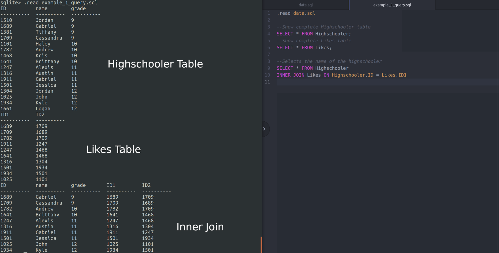
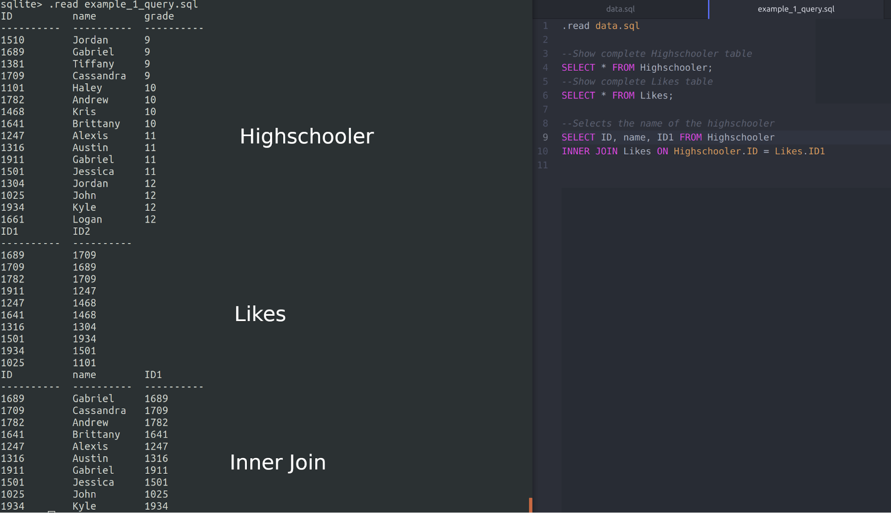

# Inner Joins

By now, you should know that a database stores data into tables based on a schema. This schema can be manipulated using queries to find specific data. A common way of filtering and finding specific sets of data is through the use of inner joins.

An inner join compares two tables, and "joins" them together. This is accomplished through the use of a key attribute that is unique on each respective table. The overlap between the keys in the two tables is what will be joined together by the inner join. This can be seen in the venn diagram below. The inner join creates a virtual table that is not permanently stored, but used for the query.

The data we will be using for our example is from Jennifer Widom’s database course, which can be found [here](https://lagunita.stanford.edu/courses/Engineering/db/2014_1/about).

## Schema

To understand how to solve our problem, we must briefly examine and understand the three tables of our dataset.

``` SQL
create table Highschooler(ID int, name text, grade int);
create table Friend(ID1 int, ID2 int);
create table Likes(ID1 int, ID2 int);
```

The `Highschooler` table contains the student’s ID number, name, and grade level.

``` SQL
insert into Highschooler values (1510, 'Jordan', 9);
insert into Highschooler values (1689, 'Gabriel', 9);
insert into Highschooler values (1381, 'Tiffany', 9);
insert into Highschooler values (1709, 'Cassandra', 9);
insert into Highschooler values (1101, 'Haley', 10);
insert into Highschooler values (1782, 'Andrew', 10);
insert into Highschooler values (1468, 'Kris', 10);
insert into Highschooler values (1641, 'Brittany', 10);
insert into Highschooler values (1247, 'Alexis', 11);
insert into Highschooler values (1316, 'Austin', 11);
insert into Highschooler values (1911, 'Gabriel', 11);
insert into Highschooler values (1501, 'Jessica', 11);
insert into Highschooler values (1304, 'Jordan', 12);
insert into Highschooler values (1025, 'John', 12);
insert into Highschooler values (1934, 'Kyle', 12);
insert into Highschooler values (1661, 'Logan', 12);
```

The `Friend` table contains two ID numbers.  It is read as `ID1` is friends with `ID2`.

```SQL
insert into Friend values (1510, 1381);
insert into Friend values (1510, 1689);
insert into Friend values (1689, 1709);
insert into Friend values (1381, 1247);
insert into Friend values (1709, 1247);
insert into Friend values (1689, 1782);
insert into Friend values (1782, 1468);
insert into Friend values (1782, 1316);
insert into Friend values (1782, 1304);
insert into Friend values (1468, 1101);
insert into Friend values (1468, 1641);
insert into Friend values (1101, 1641);
insert into Friend values (1247, 1911);
insert into Friend values (1247, 1501);
insert into Friend values (1911, 1501);
insert into Friend values (1501, 1934);
insert into Friend values (1316, 1934);
insert into Friend values (1934, 1304);
insert into Friend values (1304, 1661);
insert into Friend values (1661, 1025);
```

The `Likes` table contains the data of which highschoolers like eachother.  It is read as `ID1` likes `ID2`.

```SQL
insert into Likes values(1689, 1709);
insert into Likes values(1709, 1689);
insert into Likes values(1782, 1709);
insert into Likes values(1911, 1247);
insert into Likes values(1247, 1468);
insert into Likes values(1641, 1468);
insert into Likes values(1316, 1304);
insert into Likes values(1501, 1934);
insert into Likes values(1934, 1501);
insert into Likes values(1025, 1101);
```

## Basic Example

We can see that the `ID` attribute in the `Highschooler` table may correspond to either the `ID1` or the `ID2` attribute of the Likes table.

Let’s go back to the Venn-diagram example.  Let one circle be the IDs of “Highschooler” and the other circle be the `ID1` and/or `ID2` from the “Likes” table. As stated before, the overlap is the commonality.



In this case, the commonality are the IDs that both the tables share. We know that there is a relationship between the two tables. We can use this knowledge to shrink or manipulate our data.

In this example, an inner join of the Highschooler ID and Likes ID1 has occurred. First, the original output for the “Highschooler” table and “Likes” table is been provided for an easy visual.  



The syntax for the inner join is

``` SQL
INNER JOIN Likes ON Highschooler.ID = Likes.ID1
```

The inner join occurs when Highschooler ID is equal to ID1 of the Likes table.  If the data is matched, it is joined into one table.  To make this even easier to visualize, we can show only the output “Highschooler” ID, name and “Likes” ID1.



## More Complex Examples

Although single inner joins are useful, we tend to see the most use from multiple joins. These joins are tremendously more readable and performant than other methods of querying, and allow for complex pairing of data.

### Multiple Joins

Sometimes, it is useful to inner join multiple tables together into one big temporary table. In the case of the Highschooler
schema, it can be useful to join two (or more!) friends together in what would effectively look like a chain.

`Highschooler 1 -> Highschooler 2 -> … -> Highschooler n`

This would be accomplished by joining the highschooler table to the friends table (similarly to the aforementioned join above), then continuing to join tables to the previously joined table:

``` SQL
FROM Highschooler AS H1
INNER JOIN Friends AS F1 ON H1.id = F1.id1
INNER JOIN Highschooler AS H2 ON F1.id2 = H2.id
```

In the above example, we are also using an _alias_, which is denoted by the syntax `FROM [Table] AS [Alias]`. This just creates a memorable title for the table you are querying or interacting with.

This can be useful in cases where it is necessary to query against multiple different permutations of the data.

### Virtual Table Joins

Another exciting use of inner joins (or joins in general) is the ability to perform joins on virtual tables. Instead of joining to a full table, a subquery can be used to pare down your results (or, perform a nested join!)

``` SQL
INNER JOIN (Subquery here!) AS alias ON …
```

This is an extremely powerful querying technique to use, but it comes with some downsides. Subquerying is worse from a readability standpoint, as nesting can be hard to read. Additionally, some SQL interpreters are unable to optimize nested subqueries, and run them all as separate queries. In a production environment, this could cause major latencies on querying.

Despite the disadvantages, sometimes nested queries (used above to create virtual tables) are necessary. When they are necessary, it is important to ensure that performance constraints are considered and tested before prime-time use.
